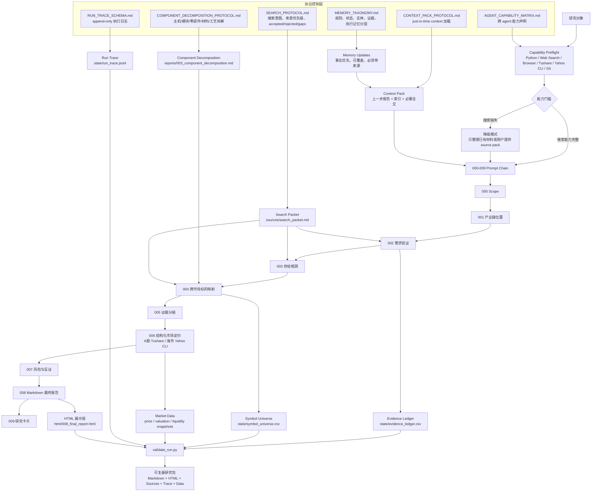

# Serenity AI Chain Analysis

这是一个用于运行 AI 产业链瓶颈研究的 prompt-chain 项目。项目核心是一组从 `000.md` 到 `009.md` 的提示词，用来把一个研究对象从“对象定义”逐步推进到“产业链位置、需求验证、供给瓶颈、标的映射、证据分级、市场定价、反证条件、最终报告和研究卡片”。

## 项目目标

本项目不是自动交易系统，也不是直接给出买卖建议。它的目标是沉淀一个可复用的研究雷达：

- 寻找 AI 超级周期中可能出现的产业链瓶颈；
- 区分产业事实、合理推理、市场叙事和未验证假设；
- 保留负面证据和反证条件；
- 把每轮研究输出成可追溯的 Markdown 报告、证据台账和结构化市场数据。

## Prompt Chain

| 步骤 | 文件 | 作用 |
|---|---|---|
| 000 | `000.md` | 启动研究与界定对象 |
| 001 | `001.md` | 判断产业链位置与 N 阶传导 |
| 002 | `002.md` | 验证需求源头和需求加速 |
| 003 | `003.md` | 分析供给弹性和瓶颈强度 |
| 004 | `004.md` | 映射候选公司和利润兑现路径 |
| 005 | `005.md` | 做证据分级和叙事拆分 |
| 006 | `006.md` | 分析市场定价、估值和拥挤度 |
| 007 | `007.md` | 建立风险和反证条件 |
| 008 | `008.md` | 输出综合研究报告 |
| 009 | `009.md` | 沉淀研究卡片 |

## Agent Harness 架构图



## 核心框架

- `AGENT_FRAMEWORK.md`：主研究框架。
- `FRAMEWORK_ADDENDUM_CROSS_MARKET.md`：跨市场控制层，防止把“重点研究 A 股/中国上市公司”误执行成“只研究 A 股/中国上市公司”。
- `AGENT_CAPABILITY_MATRIX.md`：跨 agent 运行前的能力矩阵和缺失能力处理规则。
- `SEARCH_PROTOCOL.md`：搜索步骤的来源优先级、search packet 和证据落账规则。
- `CONTEXT_PACK_PROTOCOL.md`：000-009 每一步的 just-in-time context 加载规则。
- `RUN_TRACE_SCHEMA.md`：`state/run_trace.jsonl` 的执行日志格式。
- `MEMORY_TAXONOMY.md`：项目规则、run state、entity、evidence、execution memory 的分层规则。
- `COMPONENT_DECOMPOSITION_PROTOCOL.md`：设备/主机/系统类主题的上游零部件、材料、工艺、后市场拆解规则。
- `AGENTS.md`：给后续 agent 的项目入口规则。
- `PROJECT_RETRO_AND_OPTIMIZATION.md`：基于两个案例复盘后的问题清单、根因和优化方向。

## 数据层

项目区分两类数据来源：

- 结构化市场数据：A 股优先使用 Tushare；美股、港股和部分海外市场优先使用本地 Yahoo Finance CLI 工具 `tools/yf`。
- 公开信息搜索：用于公司公告、年报、供应链证据、卖方覆盖、社媒热度和热门共识判断。

密钥安全规则：

- 不把 Tushare token 或其他密钥写入 Markdown、CSV、YAML 或脚本。
- 默认从环境变量 `TUSHARE_TOKEN` 读取。
- 提交前运行校验脚本和敏感信息扫描。

## 跨 Agent 运行

本项目可以由 Codex、Claude Code、OpenClaw 或其他具备文件读写和搜索能力的 agent 执行，但效果是否接近，取决于启动前是否把能力边界说清楚。

推荐启动顺序：

1. 先读 `AGENTS.md`。Claude Code 还会自动读取 `CLAUDE.md`，该文件只是把 Claude 的入口转回同一套项目协议。
2. 跑 capability preflight，按实际工具填写 `--agent-name`、`--web-search` 和 `--browser`。
3. 如果当前 agent 没有 web search，不独立执行 `002` 到 `005`，只整理已有材料、读取用户提供的 source pack，或准备 search packet。
4. 搜索密集步骤必须更新 `sources/search_packet.md`，并把重要来源落到 `sources/source_index.md` 或 `state/evidence_ledger.csv`。
5. 完成后跑 `scripts/validate_run.py`，再决定是否提交。

示例：

```powershell
python scripts\capability_preflight.py --run-dir "research_runs\YYYY-MM-DD-研究对象" --agent-name "Claude Code" --web-search yes --browser yes
```

Windows 终端如果显示中文乱码，优先使用 UTF-8 读取文件，例如：

```powershell
Get-Content README.md -Encoding UTF8
```

## 目录结构

```text
.
├── 000.md ... 009.md
├── AGENT_FRAMEWORK.md
├── FRAMEWORK_ADDENDUM_CROSS_MARKET.md
├── AGENTS.md
├── CLAUDE.md
├── PROJECT_RETRO_AND_OPTIMIZATION.md
├── scripts/
│   └── validate_run.py
├── templates/
├── tools/
│   └── yf
├── skills/
├── .agents/
└── research_runs/
```

## 已完成案例

### 数据中心电力设备

目录：`research_runs/2026-06-03-数据中心电力设备中国上市公司`

结论摘要：数据中心电力设备是 AI 基础设施从算力传导到电力容量的二阶/三阶机会，但需要补充海外电力设备龙头和全球定价锚。

### 液冷二级零部件

目录：`research_runs/2026-06-03-液冷二级零部件`

结论摘要：液冷需求真实，但“液冷龙头”已被市场充分关注；更值得拆的是管路、流体连接器、冷板、manifold、泵阀、密封/材料等二级或三级零部件。

### 数据中心燃气发电机

目录：`research_runs/2026-06-03-数据中心燃气发电机`

结论摘要：数据中心自备/近场燃气发电是电网接入瓶颈下的替代供电子题，但必须同时跟踪海外 OEM、数据中心客户、燃机整机、发电机组和区域工程交付能力。

### 数据中心燃气发电机上游拆解版

目录：`research_runs/2026-06-03-数据中心燃气发电机上游拆解版`

结论摘要：新增 component decomposition 后，研究重心从“燃气发电机整机/OEM”进一步拆到热端部件、叶片/导向叶片、燃烧室、镍基高温合金、热障涂层、精密铸造、检测和后市场服务等二级/三级瓶颈。

## 运行校验

每次完成一个研究目录后，运行：

```powershell
python scripts\validate_run.py "research_runs\YYYY-MM-DD-研究对象"
```

校验内容包括：

- 000-009 报告是否齐全；
- 证据台账和市场数据 CSV 是否可解析；
- `004_targets.md` 是否有跨市场覆盖；
- `symbol_universe.csv` 是否只覆盖单一市场；
- 设备/主机/系统类主题是否缺少 component decomposition；
- 是否误写入 Tushare token。

启动一个新 run 前，建议先运行能力预检：

```powershell
python scripts\capability_preflight.py --run-dir "research_runs\YYYY-MM-DD-研究对象" --agent-name Codex --web-search yes --browser yes
```

该脚本会生成 `state/capability_report.json`，只记录 token 是否存在，不记录 token 内容。

## HTML 报告

Markdown 是研究源文件，HTML 是展示层。每个研究 run 可以在 `html/` 目录输出静态页面：

```text
research_runs/YYYY-MM-DD-研究对象/html/008_final_report.html
```

当前示例：

- `research_runs/2026-06-03-液冷二级零部件/html/008_final_report.html`

HTML 页面应保留 Markdown 链接、来源索引、证据边界和“不构成投资建议”的提示。视觉主题可以按研究对象选择；液冷案例使用了偏 Bloomberg Terminal 的黑底高密度信息屏风格。

## GitHub 同步注意

可以上传研究框架、模板、脚本、提示词、案例报告和不含密钥的数据文件。不要上传本地环境变量、私密 token、临时缓存、`__pycache__` 或虚拟环境目录。
